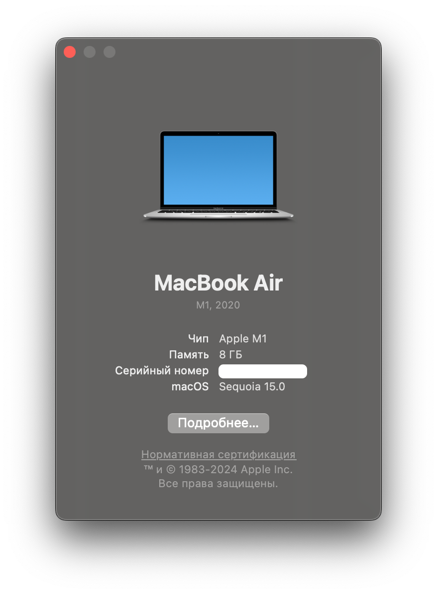

# Установка на MacOS

Для установки приложения:

1. Перейдите в раздел загрузок приложения:  
   [https://safekey.cc/#download](https://safekey.cc/#download)
2. Выберите вкладку "MacOS"
3. В зависимости от Вашей ОС и потребностей скачайте необходимый файл.\
   В случае, если в Вашем устройстве установлен процессор серии Apple M (M1, M2, M3, M4), скачивайте версию "ARM", в противном случае - x64. Проверить CPU можно в вкладке **About this Mac (Об этом Mac)**:  
     
   В зависимости от того, нужно Вам устанавливать приложение, или Вы будете запускать приложение из папки (из файла) - нужно скачать **устанавливаемую** или **портативную** версию.

### Устанавливаемая версия

Запустите файл `.dmg`и мышью перенесите иконку Safekey в директорию Applications

<figure><figcaption></figcaption></figure>

Приложение появится в списке приложений. На этом установка приложения закончена.

### Портативная версия

После загрузки файла zip распакуйте его и запустите файл Safekey.app.
